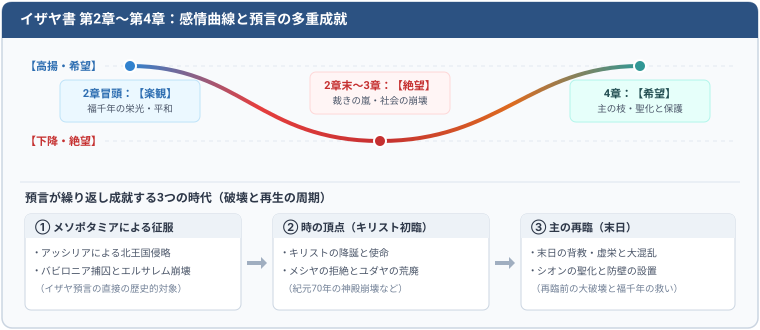

イザヤ書3章

イザヤ書第2章から第4章は、「楽観」から「絶望」を経て、再び「希望」へと至る曲線を描いています。第2章冒頭ではユダとエルサレムの福千年の栄光が描かれますが、章末では一転して、平穏に先立つ裁きの嵐が描写されます。この破壊のテーマは第3章へと引き継がれ、第4章で再び神の祝福と保護の約束が示されます。

### 破壊と再生の周期的パターン

この「破壊と再生」の周期パターンは、イザヤの預言の本質であり、歴史の中で繰り返し成就してきました。メソポタミアによる征服は預言の直接の対象ですが、それは一連の成就の始まりにすぎません。ここでの裁きは、その後の歴史や、キリスト再臨前の大破壊にも重なります。

第3章と第4章の成就として、本書では以下の3つの出来事を取り上げます。

1. **アッシリアとバビロニアによる征服**（イザヤの同時代のアッシリア侵入と、紀元前586年のバビロニア捕囚）
2. **「時の頂点」におけるキリストの降誕と使命**
3. **主の再臨（末日）**

したがって、第3章と第4章に記された混乱・破壊・虚栄の預言は、これらすべての時代を描写している可能性があります。

### 本章（第3章〜第4章）の3つの区分

第3章・第4章は、次の3つの区分に分けることができます。

- **3:1–15**：指導層の崩壊と社会的混乱（パンと水、頼みの綱の喪失）
- **3:16–4:1**：シオンの娘たちの高慢と虚栄に対する裁き
- **4:2–6**：残された者は聖なるものとなる、シオンを覆う神の栄光と保護

以下、それぞれの区分について、歴史的文脈と末日に関する預言の可能性を解説します。

当時の社会は農業が中心であり、土地の豊穣さは人々の最大の関心事でした。そのため、第3章冒頭に描かれる裁きは、当時の人々にとって極めて切実で痛切なものでした。

---

> **1. For, behold, the Lord, the Lord of hosts, doth take away from Jerusalem and from Judah the stay and the staff, the whole stay of bread, and the whole stay of water,**  
> **1. 見よ、主、万軍の主はエルサレムとユダからささえとなり、頼みとなるもの——すべてささえとなるパン、すべてささえとなる水——を取り去られる。**

ヘブライ語原文において、「ささえ」と「頼み」は同一の語根から派生した男性形（mas’en）と女性形（mas’enah）の対句です。男女両方の形を重ねて用いることで、あらゆる支えの完全な喪失（肉体的・社会的・霊的な全面崩壊）を強調しています。したがって、この描写は単なる食糧難にとどまらず、国家と共同体の全壊を象徴しています。

1. 肉体的な飢餓
国から「ささえ」や「頼み」を取り去ることは、天幕の支柱を急に引き抜いて全体を崩壊させるようなものです。「パンと水」の喪失は文字通りの飢饉を意味し、エルサレム包囲の歴史の中で現実のものとなりました。

- バビロニアによる包囲（前6世紀）：エレミヤは「町の中の食糧は激しく欠乏し、民は食物を得られなくなった」（エレミヤ52:6）と記録しています。
- ローマ軍による包囲（西暦70年）：状況はさらに悲惨を極め、歴史家ヨセフスは、飢餓のあまり母親が我が子を口にするほどの惨状を記録しています（『ユダヤ戦記』6:3）。

2. 霊的な飢餓
「パンと水」は、キリストや福音、贖罪の象徴でもあります（アモス8:11–12参照）。主ご自身が、古代イスラエルの真の「ささえ」であり「頼み」でした（イザヤ48:2、1ニーファイ20:2、詩篇23:4）。この支えを取り去られることは、霊的な養いを絶たれることを意味します。

続く第2節では、ユダが主の臨在だけでなく、預言者や指導者（神権の導き手）までも失うことが記され、この霊的飢餓の徹底ぶりが示されています。

個人の解釈 - もちろん肉体的な飢餓は末日の時代の戦争による災難のことを指してる可能性がありますが、戦争のない時代、地域に生きてる人たちには霊的な飢餓に注目するのが妥当かもしれません。主が私達の真の「ささえ」であり「頼み」であることを忘れた場合、聖約の祝福、「聖霊」が取り去られてしまうのです。

> **2. The mighty man, and the man of war, the judge, and the prophet, and the prudent, and the ancient,**  
> **2. すなわち勇士と軍人、裁判官と預言者、占い師と長老、**

本節はイスラエルの深刻な苦境を示しています。同時代のアモスが、

「主なる神はそのしもべである預言者にその隠れた事を示さないでは、何事をもなされない」（アモス3:7）

と記したように、預言者がいなくなれば、誰が人々に悔い改めを呼びかけられるでしょうか。導き手を失った民は、まさに「盲人が盲人を手引きして穴に落ちる」（マタイ15:14）状態に陥ります。

個人の解釈 - 私達には現代の預言者が与えられていますが、もし彼らの言葉に耳を傾けなくなった時、謙遜と忍耐をもって聞き従おうとしなかったとき、私たちの心の中から預言者が取り去られてしまうのではないでしょうか？

> **3. The captain of fifty, and the honourable man, and the counsellor, and the cunning artificer, and the eloquent orator.**  
> **3. 五十人の長と身分の高い人、議官と巧みな魔術師、老練なまじない師を取り去られる。**

> **4. And I will give children to be their princes, and babes shall rule over them.**  
> **4. わたしはわらべを立てて彼らの君とし、みどりごに彼らを治めさせる。**

> **5. And the people shall be oppressed, every one by another, and every one by his neighbour: the child shall behave himself proudly against the ancient, and the base against the honourable.**  
> **5. 民は互に相しえたげ、人はおのおのその隣をしえたげ、若い者は老いたる者にむかって高ぶり、卑しい者は尊い者にむかって高ぶる。**

多岐にわたる指導者の列挙は、軍事・政治・文化のあらゆる分野から、優れた指導層が根こそぎ失われることを示しています。これは後のバビロン捕囚において現実となりました。

歴史家ヨセフスによると、ユダの王エホヤキム（当時25歳）が反逆した際、バビロンのネブカデネザル王はエルサレムから「彼らの花といえる時代の、偉大な尊厳ある者たちを連れて行った。……その主要な人物の一人が預言者エゼキエルであった。』10:6）と記録されています。父の死後、わずか18歳で即位した息子エホヤキンも、わずか3か月後に再侵攻を受け、父と同じ運命をたどることになりました。

「彼はまたエルサレムのすべての市民、およびすべてのつかさとすべての勇士、ならびにすべての木工と鍛冶一万人を捕えて行った。残った者は国の民の貧しい者のみであった。」（列王下24:14）

指導層が排除された後に残されたのは、無力で貧しい大衆だけでした。第4節の「わらべ（気まぐれな子ども）」や「みどりご」による統治には、主に3つの解釈が成り立ちます。

比喩的解釈（精神的な未熟さ）
国家の混乱を収拾する器量や経験がなく、幼稚で浅はかな判断しか下せない無能な指導者たちを指します。

文字通りの解釈（若年王の即位）
バビロン捕囚前のユダ王国では、極めて若い王が相次いで即位しました。アハズ、ヒゼキヤ、アモン、エホヤキムは20代前半、マナセは12歳、ヨシヤは8歳で王座についています。エホヤキンもわずか18歳（歴代誌の記録では8歳）でした（列王下24:8、歴代下36:9）。

預言的解釈（異邦人による支配）
ここで言う「子ども」とは、イスラエルの家の外にある異邦の支配者を指しているとも解釈できます。福音書には、神は「これらの石ころからでも、アブラハムの子を起こすことができる」（ルカ3:8）とあります。ジョセフ・スミスはこの「石ころ」について、後に古代ユダヤ人を征服・支配した異邦人を指していると説明しました（WJS pp.234–36, 294–95）。

個人の解釈 - 主が取り去れれ、預言者が取り去られ、指導者達も取り去られてしまった時、残されたのは高慢で愛のない人々のみになってしまいました。これはイエスが与えられた最も大切な戒めの反意的な表現と言っても過言ではないかもしれません。以下を読んで比較してみましょう。

「自分を愛するように、あなたの隣り人を愛せよ」（マタイ22:39）
「民は互に相しえたげ、人はおのおのその隣をしえたげ、若い者は老いたる者にむかって高ぶり、卑しい者は尊い者にむかって高ぶる。」（イザヤ3:5）

主を愛しているか、預言者を支持しているか、指導者を支持しているか、隣人を愛しているか、そのような問いかけをイザヤは私たちに投げかけているのかもしれません。

> **6. When a man shall take hold of his brother of the house of his father, saying, Thou hast clothing, be thou our ruler, and let this ruin be under thy hand:**  
> **6. その時、人はその父の家で、兄弟をつかまえて言う、「あなたは外套を持っている、わたしたちのつかさびとになって、この荒れ跡をあなたの手で治めてください」と。**

> **7. In that day shall he swear, saying, I will not be an healer; for in my house is neither bread nor clothing: make me not a ruler of the people.**  
> **7. その日、彼は声をあげて言う、「わたしはいやす者となることはできません、わたしの家にはパンもなく、外套もありません、わたしを立てて、民のつかさびとにしないでください」。**

> **8. For Jerusalem is ruined, and Judah is fallen: because their tongue and their doings are against the Lord, to provoke the eyes of his glory.**  
> **8. これは彼らの言葉と行いとが主にそむき、その栄光の目をおかしたので、エルサレムはつまずき、ユダは倒れたからである。**

これらの節は、家族制度（族長制度）に基づく社会の崩壊と、国全体の深刻な貧困を改めて浮き彫りにする重要な場面です。

ここで「父の家で、兄弟をつかまえて頼み込む」という状況が描かれているのは、動乱の中で父親が家族を捨てて姿を消してしまい、本来なら家長としての責任を果たすべき息子（長男）もその義務を拒否したためです。

また、頼む側が指導者の資格として挙げている「外套（がいとう／ヘブライ語でシムラー）」は、決して豪華な衣服ではなく、それ一枚が着る人の境遇を表すようなごく質素なものです。つまり頼んでいる側は、「外套を持っているのなら、最低限生きていくだけの食事と衣服はお持ちですよね（だから私たちのリーダーになってください）」と、切羽詰まった懇願をしているのです。

物資の面でも社会的な面でも支えとなるものが何一つない以上、頼まれた兄弟がリーダーという名誉ある立場を断ってしまうのも無理のないことでした。

個人の解釈 - 霊的な面でこれらの節を解釈するとどうなるでしょうか？
主が預言者や指導者、聖典や儀式など、あらゆる手段を通して霊的な導きや癒しを与えようとされても、民の「言葉と行い」が主に背き、本質的には主ではなく他のものに頼っていたため、聖約の祝福である「御子の御霊」を受けることができなかった状態を指しているのかもしれません。
どんなに外的な助けを求めても、自らが悔い改めて主に立ち返らない限り、霊的な空腹や傷を癒すことはできないという教訓としても読めます（これは解釈の一つの側面にすぎず、イザヤはほかにも多くの大切なメッセージを伝えていると考えられます）。

### 1〜8節のカイアズマス（交差対句法）構造

イザヤ書第3章1〜8節には、ヘブライ詩文に特有の「カイアズマス（交差対句法・同心円構造）」が見られます。中央の「不公正と抑圧（F）」を中心として、前後のテーマと聖句が対称関係を成しています。

| テーマ | アウトライン | 節 | 聖文の引用 |
| :--- | :---: | :---: | :--- |
| 主はその民を裁きとがめられる | A | 1 | 「･･･主はエルサレムとユダから･･･取り去られる」 |
| 肉体の糧となる食物の喪失 | B | 1 | 「ささえとなり、頼みとなるもの」 |
| 軍事防衛の喪失、兵士の喪失 | C | 2 | 「勇士と軍人」 |
| 社会秩序と指導者の喪失 | D | 3 | 「身分の高い人、議官」 |
| 無能な若い支配者、役割逆転 | E | 4 | 「みどりごに彼らを治めさせる。」 |
| 不公正と抑圧 | F | 5 | 「民は互に相しえたげ」 |
| 子どもが大人を治める、役割逆転 | E' | 5 | 「若い者は老いたる者にむかって高ぶり」 |
| 社会における指導者の絶望的欠如 | D' | 6 | 「わたしたちのつかさびとになって、この荒れ跡をあなたの手で治めてください」 |
| 戦士の傷をいやす者の喪失 | C' | 7 | 「わたしはいやす者となることはできません」 |
| 肉体の糧の喪失 | B' | 7 | 「わたしの家にはパンもなく、外套もありません」 |
| 選ばれた人々の滅び | A' | 8 | 「彼らの言葉と行いとが主にそむき、･･･エルサレムはつまずき、ユダは倒れたからである。」 |

> **9. The shew of their countenance doth witness against them; and they declare their sin as Sodom, they hide it not. Woe unto their soul! for they have rewarded evil unto themselves.**  
> **9. 彼らの不公平は彼らにむかって不利なあかしをし、ソドムのようにその罪をあらわして隠さない。わざわいなるかな、彼らはみずから悪の報いをうけた。**

> **10. Say ye to the righteous, that it shall be well with him: for they shall eat the fruit of their doings.**  
> **10. 正しい人に言え、彼らはさいわいであると。彼らはその行いの実を食べるからである。**

> **11. Woe unto the wicked! it shall be ill with him: for the reward of his hands shall be given him.**  
> **11. 悪しき者はわざわいだ、彼は災をうける。その手のなした事が彼に報いられるからである。**

ユダ王国が滅亡に至った決定的な理由は、彼らが罪を犯したことだけでなく、罪を隠そうともしなくなったという道徳観の麻痺にありました。ソドムの住民がロトの家に押し寄せ、臆面もなく欲望を露骨に宣言したように（創世記19:5）、当時のエルサレムとユダの人々もまた邪悪に陥ってました。

豊穣儀式（豊沃の儀式）と性の誤用 - 彼らの罪は単なる無秩序にとどまらず、カナンの偶像崇拝（バアルやアシュタロテ信仰）に伴う「豊沃の儀式」を取り入れた点にありました。 

「彼らもまた、すべての高い丘の上やすべての青草の木の下に、高き所、石の柱、アシェラ像を建てた。その地には神殿男娼さえいた。彼らは、主がイスラエルの子らの前から追い払われた異邦の民のすべての忌むべきならわしをまねて行った。」(列王記上14章23〜24節)

「王はまた、主の宮にあった神殿男娼の家を取り壊した。そこは女たちがアシェラのために幕を織っていた所である。」(列王記下23章7節)

ただ一方で、イザヤはたとえ国や地域が崩壊に向かう中であっても、自らを救う唯一の方法を10節で述べてます。それは「義（神との聖約に対する忠実さ）」を行うことです。主に従う義人は、周囲の状況、もしくは時代がいかなるものであっても「自らの正しい行いの実」を豊かに味わうことができるのです。

個人の解釈 - イザヤは当時のユダの人々がどれほど霊的に堕落していたかを強調していますが、現代の私たちがその言葉に乗っかって過去の人々を一方的に批判するのは、正しい態度ではないと感じます。また、「周囲の環境や時代の悪さのせいで、自分の霊的標準が保てない」と嘆くことも同様です。そうではなく、周囲がどうあろうとも、10節にある「正しい行い（義）」を貫くために今の自分に何ができるのかを謙虚に自問することこそが大切だと感じます。

> **12. As for my people, children are their oppressors, and women rule over them. O my people, they which lead thee cause thee to err, and destroy the way of thy paths.**  
> **12. わが民は幼な子にしえたげられ、女たちに治められる。ああ、わが民よ、あなたを導く者はかえって、あなたを迷わせ、あなたの行くべき道を混乱させる。**

> **13. The Lord standeth up to plead, and standeth to judge the people.**  
> **13. 主は言い争うために立ちあがり、その民をさばくために立たれる。**

> **14. The Lord will enter into judgment with the ancients of his people, and the princes thereof: for ye have eaten up the vineyard; the spoil of the poor is in your houses.**  
> **14. 主はその民の長老と君たちとをさばいて、「あなたがたは、ぶどう畑を食い荒した。貧しい者からかすめとった物は、あなたがたの家にある。**

> **15. What mean ye that ye beat my people to pieces, and grind the faces of the poor? saith the Lord God of hosts.**  
> **15. なぜ、あなたがたはわが民を踏みにじり、貧しい者の顔をすり砕くのか」と万軍の神、主は言われる。**

### 12〜15節の対応構造（カイアズマスの展開）

前半（1〜8節）のテーマに対応する、12〜15節の構造です。

| テーマ | アウトライン | 節 | 聖文の引用 |
| :--- | :---: | :---: | :--- |
| 人々の抑圧 | F' | 12 | 「わが民は幼な子にしえたげられ」 |
| 伝統的な指導的役割の逆転 | E'' | 12 | 「女たちに治められる」 |
| 社会的、霊的な混乱状態 | D'' | 12 | 「あなたを迷わせ、あなたの行くべき道を混乱させる」 |
| 主が抑圧された者たちを守られる | C'' | 13 | 「主は言い争うために立ちあがり」 |
| 邪悪な指導者たちが弱き者らの糧を奪い取る | B'' | 14 | 「あなたがたは、ぶどう畑を食い荒した。貧しい者からかすめとった物は、あなたがたの家にある」 |
| 選ばれた人々の破砕 | A'' | 15 | 「なぜ、あなたがたはわが民を踏みにじり、貧しい者の顔をすり砕くのか」 |

このカイアズマスの構造からわかるようにイザヤはA-Fの概念を２回も繰り返し、イスラエルの民の罪を強調してます。

> **16. Moreover the Lord saith, Because the daughters of Zion are haughty, and walk with stretched forth necks and wanton eyes, walking and mincing as they go, and making a tinkling with their feet:**  
> **16. 主は言われた、シオンの娘らは高ぶり、首をのばしてあるき、目でこびをおくり、その行くとき気どって歩き、その足でりんりんと鳴り響かす。**

> **17. Therefore the Lord will smite with a scab the crown of the head of the daughters of Zion, and the Lord will discover their secret parts.**  
> **17. それゆえ、主はシオンの娘らの頭を撃って、かさぶたでおおい、彼らの隠れた所をあらわされる。**

> **18. In that day the Lord will take away the bravery of their tinkling ornaments about their feet, and their cauls, and their round tires like the moon,**  
> **18. その日、主は彼らの美しい装身具と服装すなわち、くるぶし輪、髪ひも、月形の飾り、**

> **19. The chains, and the bracelets, and the mufflers,**  
> **19. 耳輪、腕輪、顔おおい、**

> **20. The bonnets, and the ornaments of the legs, and the headbands, and the tablets, and the earrings,**  
> **20. 頭飾り、すね飾り、飾り帯、香箱、守り袋、**

> **21. The rings, and nose jewels,**  
> **21. 指輪、鼻輪、**

> **22. The changeable suits of apparel, and the mantles, and the wimples, and the crisping pins,**  
> **22. 礼服、外套、肩掛、手さげ袋、**

> **23. The glasses, and the fine linen, and the hoods, and the veils.**  
> **23. 薄織の上着、亜麻布の着物、帽子、被衣などを取り除かれる。**

> **24. And it shall come to pass, that instead of sweet smell there shall be stink; and instead of a girdle a rent; and instead of well set hair baldness; and instead of a stomacher a girding of sackcloth; and burning instead of beauty.**  
> **24. 芳香はかわって、悪臭となり、帯はかわって、なわとなり、よく編んだ髪はかわって、かぶろとなり、はなやかな衣はかわって、荒布の衣となり、美しい顔はかわって、焼き印された顔となる。**

> **25. Thy men shall fall by the sword, and thy mighty in the war.**  
> **25. あなたの男たちはつるぎに倒れ、あなたの勇士たちは戦いに倒れる。**

> **26. And her gates shall lament and mourn; and she being desolate shall sit upon the ground.**  
> **26. シオンの門は嘆き悲しみ、シオンは荒れすたれて、地に座する。**

#### 戦争による破壊と「末日の大破壊」への多重預言（25〜26節）

エルサレムは歴史上何度も侵略と破壊を経験してきたため、イザヤのこの預言がどの特定の破壊のみを指しているのかを限定することは困難です。第18節の警告が「その日」というフレーズで始まっているように、イザヤの預言には「二重性・多重性（Dualism）」があり、古代バビロニアによる征服にとどまらず、主の再臨前の「末日」における世界規模の大破壊や戦争をも見通していると考えられます。

一部の解説書や研究者の間では、この描写が近代の戦争やホロコースト、さらには現代における「核兵器による大破壊（核ホロコースト）」の惨状に重なると指摘されることがあります。

##### 1. マッコンキー長老の説教（CR, Apr. 1979, p. 133）
十二使徒定員会のブルース・R・マッコンキー長老は、1979年4月の総大会説教「他のあらゆる被造物の上に独立して立つ（*Stand Independent above All Other Creatures*）」の中で、終わりの時に世を襲う患難、戦争、経済的混乱に備え、教会の会員が霊的にも物質的にも主と聖約に頼って自立することの重要性を説き、次のように警告しました：

> “It may be, for instance, that nothing except the power of faith and the authority of the priesthood can save individuals and congregations from the **atomic holocausts** that surely shall be.”  
> （例えば、必ず起こるであろう**核による大破壊（atomic holocausts）**から個人や会衆を救うことができるものは、信仰の力と神権の権能以外には何もない、ということになるかもしれない。）  
> —— *Conference Report*, April 1979, p. 133 / 『Ensign』1979年5月号 p. 93

マッコンキー長老は、末日に世を襲う戦乱や災難の中で、聖徒たちが生き残るための唯一の確かな防壁は、世の力ではなく「信仰の力」と「神権の権能」に拠り頼むことであると強調しました。

##### 2. 「近年の大管長会からのメッセージ」との関連
冷戦期（1970年代末〜1980年代初頭）、当時の大管長会（スペンサー・W・キンボール大管長、N・エルドン・タナー管長、マリオン・G・ロムニー管長）は、核兵器競争の激化や核戦争の脅威に対して度々公式な懸念と平和への呼びかけを発表していました。

特に1981年5月5日の「MXミサイル配備に関する大管長会公式声明」では、ユタ州およびネバダ州の砂漠地帯に巨大な大陸間弾道ミサイル（MXミサイル）基地を建設する国家計画に対し、大管長会は異例の反対声明を出しました。その中で、以下のような強い霊感された懸念を表明しています：
- 「私たちは、世界を滅亡に導きかねない核軍拡競争の拡大に対して深い憂慮を抱いている」
- 「核による大量殺戮兵器の開発と配備競争は、神の御心に反するものである」

国家の真の安全は武力ではなく、義と神への信仰によってのみもたらされると訴えました。

##### 3. イザヤ書3章（25〜26節）の解説で引用された文脈
イザヤの預言が古代バビロニア軍によるエルサレム包囲・破壊にとどまらず、**「その日（末日）」における世界規模の大破壊・戦争・核戦争（核ホロコースト）**という多重成就の可能性を示唆しているという解釈の裏付けとして、マッコンキー長老の総大会での警告や大管長会の核拡散への声明が引き合いに出されていました。

もちろん、末日における災禍は戦争や核兵器に限らず、疫病や飢餓、社会的崩壊など多様な形で現れ得ます。第3章の末尾で描かれる徹底的な破壊と荒廃は、続く第4章において、主が「シオンに残る者」の汚れを洗い清め、聖なる民として天幕と栄光の覆いをもって保護されるという「希望と贖い」の約束へと力強く転換していきます（イザヤ4:2–6参照）。
