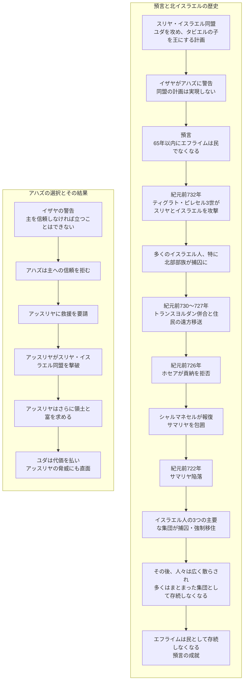

イザヤ書7章

イザヤは自身が書き記した個人的な啓示の回想録から、第三者の立場で歴史的で預言的な記述へと変更しています。

イザヤは自分がその渦中にいる出来事と、生涯の中で部分的に成就されると思われる出来事の両方の預言を記録しています。イザヤの預言のほとんどはユダに対するスリヤ・イスラエル戦争と、その地域へのアッスリヤの侵攻に関連しています。しかしながら、これらの章におけるイザヤの預言の最も重要な点は、イスラエルと共にある神の臨在をインマヌエルという名前の子どもについての預言を通して約束したということです。

インマヌエル預言が与えられたとき（紀元前734年頃）、ユダ王国はスリヤの王レヂンとイスラエルの王ペカによる攻撃の脅威にさらされていました。これらの王たちは、アハズの前身であるヨタムの治世の最後の時代に同盟を結び、エルサレムに対して戦争をしかけてきましたが、それに勝利することはできませんでした。（列王上15:37、16:5を参照）

アハズが紀元前735年に王位に就いたとき、スリヤ・エフライム連合（スリヤ・イスラエル同盟の意）はエルサレムを占領するための取り組みを新たにしました。同盟の主な意義は、その地域のすべての国々をアッスリヤ軍に対し強固な障壁になるよう統合することでした。アハズが同盟を拒否したため、レヂンとペカは、ユダを征服し、反アッスリヤ政策にもっと共感的な指導者とアハズを置き換えるつもりでいました。

スリヤとイスラエルは戦争に備え、侵攻軍を北からユダに送り込みました。激しい戦いの末、ペカの軍隊はユダの12万人の兵士を殺害し、1日で20万人の捕虜を捕らえました。（歴代下28:6-15を参照）

同盟軍は結局ユダヤ人の捕虜を解放しましたが、ユダは今やもう滅亡の危機にあるかのように見えました。北部でさらに敵が成功したという報告を受け、アハズはエルサレムを危惧し大いに恐れをなしました。（2節） イザヤが慰めのメッセージを持ってアハズに近づいたとき、アハズはキドロン渓谷にある街の水源を確認していたと思われます。

> **1. And it came to pass in the days of Ahaz the son of Jotham, the son of Uzziah, king of Judah, that Rezin the king of Syria, and Pekah the son of Remaliah, king of Israel, went up toward Jerusalem to war against it, but could not prevail against it.**  
> **1. ユダの王、ウジヤの子ヨタム、その子アハズの時、スリヤの王レヂンとレマリヤの子であるイスラエルの王ペカとが上ってきて、エルサレムを攻めたが勝つことができなかった。**

> **2. And it was told the house of David, saying, Syria is confederate with Ephraim. And his heart was moved, and the heart of his people, as the trees of the wood are moved with the wind.**  
> **2. 時に「スリヤがエフライムと同盟している」とダビデの家に告げる者があったので、王の心と民の心とは風に動かされる林の木のように動揺した。**

場所や人物のさまざまな名前をすべて適切に関連付けるために、同じ国であっても異なる名称で呼ばれることがあります。たとえば、報道機関がアメリカ合衆国や政府について、いくつかの異なる用語を用いることがありますが（政権、大統領、ワシントンDC、国会議事堂、議会、アメリカなど）、古代の権力にもさまざまな名称が存在していました。この事変に関与した3つの国の名前は次のとおりです。

| 国 | 首都 | 領土または部族 | リーダー |
| :--- | :--- | :--- | :--- |
| ユダ | エルサレム | ユダ | ダビデの家の アハズ |
| スリヤ | ダマスコ | アラム | レヂン |
| イスラエル | サマリヤ | エフライム | レマリヤの息子ペカ |

> **3. Then said the Lord unto Isaiah, Go forth now to meet Ahaz, thou, and Shear-jashub thy son, at the end of the conduit of the upper pool in the highway of the fuller’s field;**  
> **3. その時、主はイザヤに言われた、「今、あなたとあなたの子シャル・ヤシュブと共に出て行って、布さらしの野へ行く大路に沿う上の池の水道の端でアハズに会い、**

第3節では、イザヤの2人の息子の1人が紹介されています。彼の名前はシャル・ヤシュブであり、これは「残りのものが戻る」ことを意味しています。この象徴的な名前は、イスラエルの残りのものが彼らの土地に文字通り戻ることを指していますし、悔い改めて主に帰依する人々の霊的な帰還をも意味しています。実際にはイザヤ書の後の章で見られるように、実質的な帰還は霊的な帰依によって起こる部分があるため、両方の意味が同時に当てはまります。

> **4. And say unto him, Take heed, and be quiet; fear not, neither be fainthearted for the two tails of these smoking firebrands, for the fierce anger of Rezin with Syria, and of the son of Remaliah.**  
> **4. 彼に言いなさい、『気をつけて、静かにし、恐れてはならない。レヂンとスリヤおよびレマリヤの子が激しく怒っても、これら二つの燃え残りのくすぶっている切り株のゆえに心を弱くしてはならない。**

イザヤと彼の息子がアハズに会うと、預言者は王にレヂンと「レマリヤの息子」（4節）について心配しないように伝えました。イザヤはペカについて話すときに見下した言葉遣いに躊躇することなく、名前も述べずに単に「レマリヤの息子」（5、9節）と呼び続け、軽蔑を表しました。

> **5. Because Syria, Ephraim, and the son of Remaliah, have taken evil counsel against thee, saying,**  
> **5. スリヤはエフライムおよびレマリヤの子と共にあなたにむかって悪い事を企てて言う、**

> **6. Let us go up against Judah, and vex it, and let us make a breach therein for us, and set a king in the midst of it, even the son of Tabeal:**  
> **6. 「われわれはユダに攻め上って、これを脅し、われわれのためにこれを破り取り、タビエルの子をそこの王にしよう」と。**

第6節で述べられているように、スリヤ・イスラエル同盟の目的はユダを分断し、王を置き換えることでした。

> **7. Thus saith the Lord God, It shall not stand, neither shall it come to pass.**  
> **7. 主なる神はこう言われる、この事は決して行われない、また起ることはない。**

> **8. For the head of Syria is Damascus, and the head of Damascus is Rezin; and within threescore and five years shall Ephraim be broken, that it be not a people.**  
> **8. スリヤのかしらはダマスコ、ダマスコのかしらはレヂンである。（六十五年のうちにエフライムは敗れて、国をなさないようになる。）**

> **9. And the head of Ephraim is Samaria, and the head of Samaria is Remaliah’s son. If ye will not believe, surely ye shall not be established.**  
> **9. エフライムのかしらはサマリヤ、サマリヤのかしらはレマリヤの子である。もしあなたがたが信じないならば、立つことはできない』」。**

詩的な預言の中で、主はイザヤを通して語り、ユダの恐れを和らげ、イスラエルがユダに押しつけようとした破壊と散乱の運命を、イスラエルの上に臨ませることを約束されました。神の啓示には、預言と歴史的事柄に関する次の5つの区分が交互に含まれています。

| 預言（または警告） | 節 | 歴史に関すること |
| :--- | :--- | :--- |
| 同盟の目的が果たされることは無い | 7 | |
| | 8a | スリヤの頭はダマスコとレヂン |
| 65年以内にエフライム（イスラエル）は散らされる | 8b | |
| | 9a | エフライムの頭はサマリヤとレマリヤの息子 |
| あなた（ユダのアハズ）が信じないなら、守りは無い | 9b | |

左側の列にある預言の3つの区分は、歴史に関する区分を考慮しなければ、一連の預言として読み取ることができます。このような歴史と預言の組み合わせは、イザヤの著作の特徴です。

この預言でイザヤは、スリヤ・イスラエル同盟が失敗し、イスラエルが65年以内に散らされることを約束しています。預言は次の段階を経て成就しました。

まず、ティグラト・ピレセル3世（プル）は紀元前732年にスリヤとイスラエルを攻撃し、多くのイスラエル人をアッスリヤへ連れ去りました。特に北部の部族が捕虜となりました。

次に紀元前730〜727年にかけて、プルはトランスヨルダン地域を併合し、その地域からアッスリヤ帝国の遠方まで大量のイスラエル民族を捕囚として移送しました。

そして紀元前726年、ホセアがアッスリヤへの貢納金の支払いを拒否したため、プルの後継者であるシャルマネセルは報復としてイスラエルを攻撃しました。サマリヤは包囲され、ついに紀元前722年に陥落しました。

したがって、イザヤの預言から十数年以内に同盟は完全に失敗し、イスラエル人の3つの主要なグループが捕囚となり、強制的に移動させられてしまいました。その後、イスラエルの主要なグループはアッスリヤから北方の遠隔地に逃れ、「行方の知れない十部族」となりました。

彼らがアッスリヤを去ってから約50年が経過すると、彼らは非常に広く散らばってしまい、その多くはもはやまとまったグループとして存在しなくなりました。これにより、エフライムに対するイザヤの預言は完全に現実のものとなったのです。

預言の最後の部分では、イザヤはユダに対し、主への信頼を堅持していなければ立ち成り得ないと警告しています。残念ながらアハズはこの警告に留意せず、代わりにアッスリヤに救いを求めました。アッスリヤはスリヤとイスラエルの大部分を破壊することによって、スリヤ・イスラエルの攻撃を阻止しました。しかし、アッスリヤの勢いはそれにとどまらず、さらに多くの領土と富を求めたため、ユダは戦争を避けるためにその代価を支払うことになりました。

イザヤは、ユダに対する最大の敵はスリヤやエフライムではなく、アッスリヤであることを知っていました。もしユダの人々が忠実でさえあったならば、主はユダがスリヤ・イスラエルの攻撃とアッスリヤの両方に立ち向かうのを助けてくださっていたことでしょう。

不幸なことではありますが、ユダが主への信頼を築くのが困難であった理由の一つは、王であるアハズ自身に信仰と信頼が欠けていたためです。イザヤが、アハズの持てるわずかな信仰を呼び覚ますための奇跡をしるしとして求める機会を与えた後でも、彼はそのしるしを受けることを拒み、主の助言を拒否しました。それでもイザヤは彼にしるしと約束を与えました。

> **10. Moreover the Lord spake again unto Ahaz, saying,**  
> **10. 主は再びアハズに告げて言われた、**

> **11. Ask thee a sign of the Lord thy God; ask it either in the depth, or in the height above.**  
> **11. 「あなたの神、主に一つのしるしを求めよ、陰府のように深い所に、あるいは天のように高い所に求めよ」。**

> **12. But Ahaz said, I will not ask, neither will I tempt the Lord.**  
> **12. しかしアハズは言った、「わたしはそれを求めて、主を試みることをいたしません」。**

> **13. And he said, Hear ye now, O house of David; Is it a small thing for you to weary men, but will ye weary my God also?**  
> **13. そこでイザヤは言った、「ダビデの家よ、聞け。あなたがたは人を煩わすことを小さい事とし、またわが神をも煩わそうとするのか。**

> **14. Therefore the Lord himself shall give you a sign; Behold, a virgin shall conceive, and bear a son, and shall call his name Immanuel.**  
> **14. それゆえ、主はみずから一つのしるしをあなたがたに与えられる。見よ、おとめがみごもって男の子を産む。その名はインマヌエルととなえられる。**

> **15. Butter and honey shall he eat, that he may know to refuse the evil, and choose the good.**  
> **15. その子が悪を捨て、善を選ぶことを知るころになって、凝乳と、蜂蜜とを食べる。**

> **16. For before the child shall know to refuse the evil, and choose the good, the land that thou abhorrest shall be forsaken of both her kings.**  
> **16. それはこの子が悪を捨て、善を選ぶことを知る前に、あなたが恐れているふたりの王の地は捨てられるからである。**

> **17. The Lord shall bring upon thee, and upon thy people, and upon thy father’s house, days that have not come, from the day that Ephraim departed from Judah; even the king of Assyria.**  
> **17. 主はエフライムがユダから分れた時からこのかた、臨んだことのないような日をあなたと、あなたの民と、あなたの父の家とに臨ませられる。それはアッスリヤの王である」。**

> **18. And it shall come to pass in that day, that the Lord shall hiss for the fly that is in the uttermost part of the rivers of Egypt, and for the bee that is in the land of Assyria.**  
> **18. その日、主はエジプトの川々の源にいる、はえを招き、アッスリヤの地にいる蜂を呼ばれる。**

> **19. And they shall come, and shall rest all of them in the desolate valleys, and in the holes of the rocks, and upon all thorns, and upon all bushes.**  
> **19. 彼らはみな来て、険しい谷、岩の裂け目、すべてのいばら、すべての牧場の上にとどまる。**

> **20. In the same day shall the Lord shave with a razor that is hired, namely, by them beyond the river, by the king of Assyria, the head, and the hair of the feet: and it shall also consume the beard.**  
> **20. その日、主は大川の向こうから雇ったかみそり、すなわちアッスリヤの王をもって、頭と足の毛とをそり、また、ひげをも除き去られる。**

> **21. And it shall come to pass in that day, that a man shall nourish a young cow, and two sheep;**  
> **21. その日、人は若い雌牛一頭と羊二頭を飼い、**

> **22. And it shall come to pass, for the abundance of milk that they shall give he shall eat butter: for butter and honey shall every one eat that is left in the land.**  
> **22. それから出る乳が多いので、凝乳を食べることができ、すべて国のうちに残された者は凝乳と、蜂蜜とを食べることができる。**

> **23. And it shall come to pass in that day, that every place shall be, where there were a thousand vines at a thousand silverlings, it shall even be for briers and thorns.**  
> **23. その日、銀一千シケルの価ある千株のぶどうの木のあった所も、ことごとくいばらと、おどろの生える所となり、**

> **24. With arrows and with bows shall men come thither; because all the land shall become briers and thorns.**  
> **24. いばらと、おどろとが地にはびこるために、人々は弓と矢をもってそこへ行く。**

> **25. And on all hills that shall be digged with the mattock, there shall not come thither the fear of briers and thorns: but it shall be for the sending forth of oxen, and for the treading of lesser cattle.**  
> **25. くわをもって掘り耕したすべての山々にも、あなたは、いばらと、おどろとを恐れて、そこへ行くことができない。その地はただ牛を放ち、羊の踏むところとなる。**
